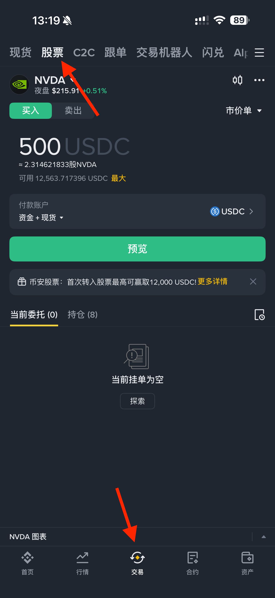
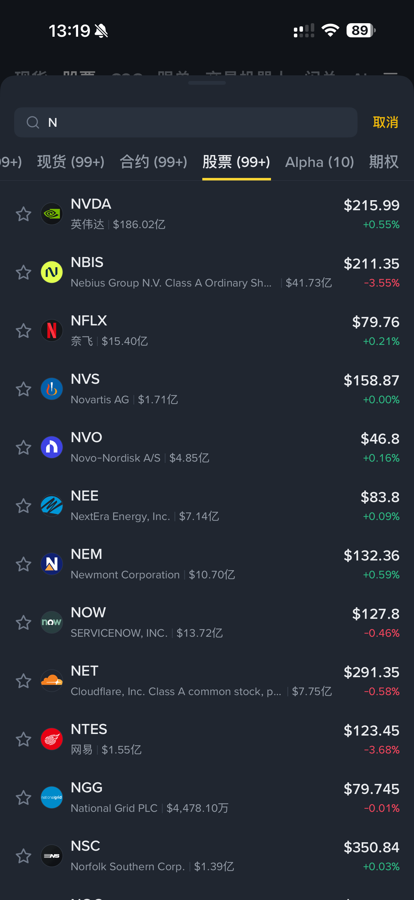

# 币安购买美股教程(以英伟达为例)

国内炒美股一直比较困难

很多朋友想买**美股**，但一直被复杂的海外开户流程和高门槛劝退。

现在只要有一个币安账户，就能直接买卖美国上市股票和 ETF 了。

最低 5 美元就能起投，不用来回折腾换汇转账，在熟悉的币安界面就能低成本体验美股的魅力。

如图所示, 在下方的选项卡选择交易, 上方选择股票即可

如果有自己想买的股票, 直接搜索即可
 

