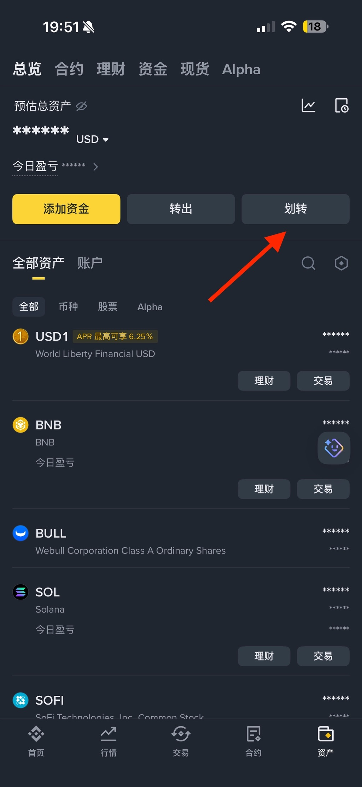
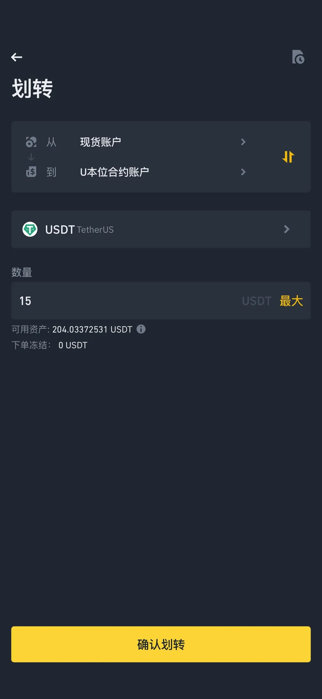
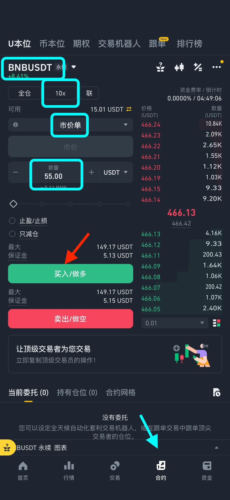
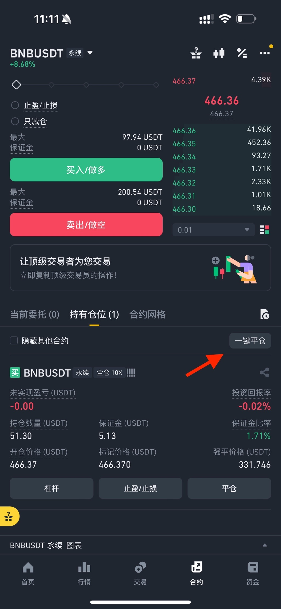

# 合约交易教程

## 目录

*  [Eh捐赠教程](https://github.com/kk9448/ehDonate/blob/main/README.md)

*  [E站捐赠用户特别福利](https://github.com/kk9448/ehDonate/tree/main/Eh捐赠用户特别福利)

*  [BN购买美股(英伟达)教程](https://github.com/kk9448/ehDonate/tree/main/BN购买美股(英伟达)教程)

*  [Ehv最新版本下载](https://github.com/kk9448/ehDonate/tree/main/App下载教程)  

*  [代捐赠](https://github.com/kk9448/ehDonate/tree/main/Eh代捐赠)

新手任务教程
完成首笔合约交易

完成后, 请telegram 私聊@carbon_x 领取8美元

1. 从现货账户划转10 usdt 到 u本位合约账户

2. 按照下图, 选择BNBUSDT永续合约, 倍数选10, 市单价, 

输入一个 > 6 的任意值, 图中是55, 点击买入做多或者做空

3. 开仓后, 立刻一键平仓即可

