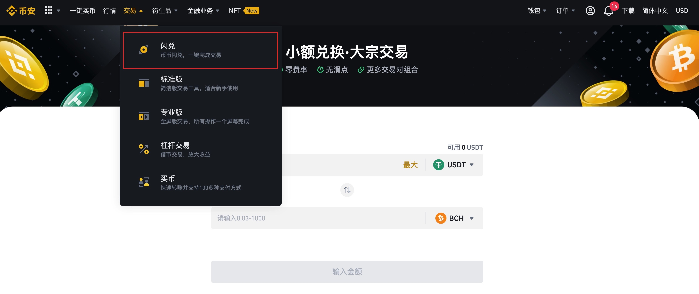
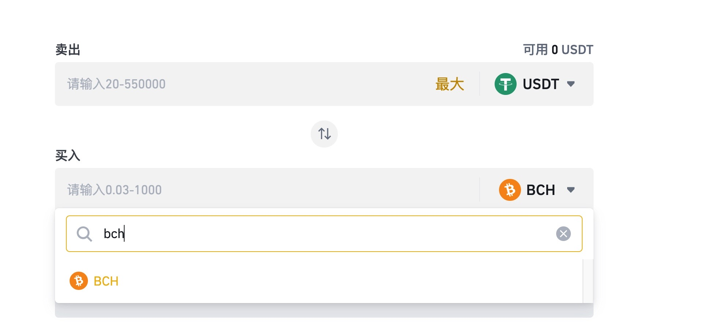
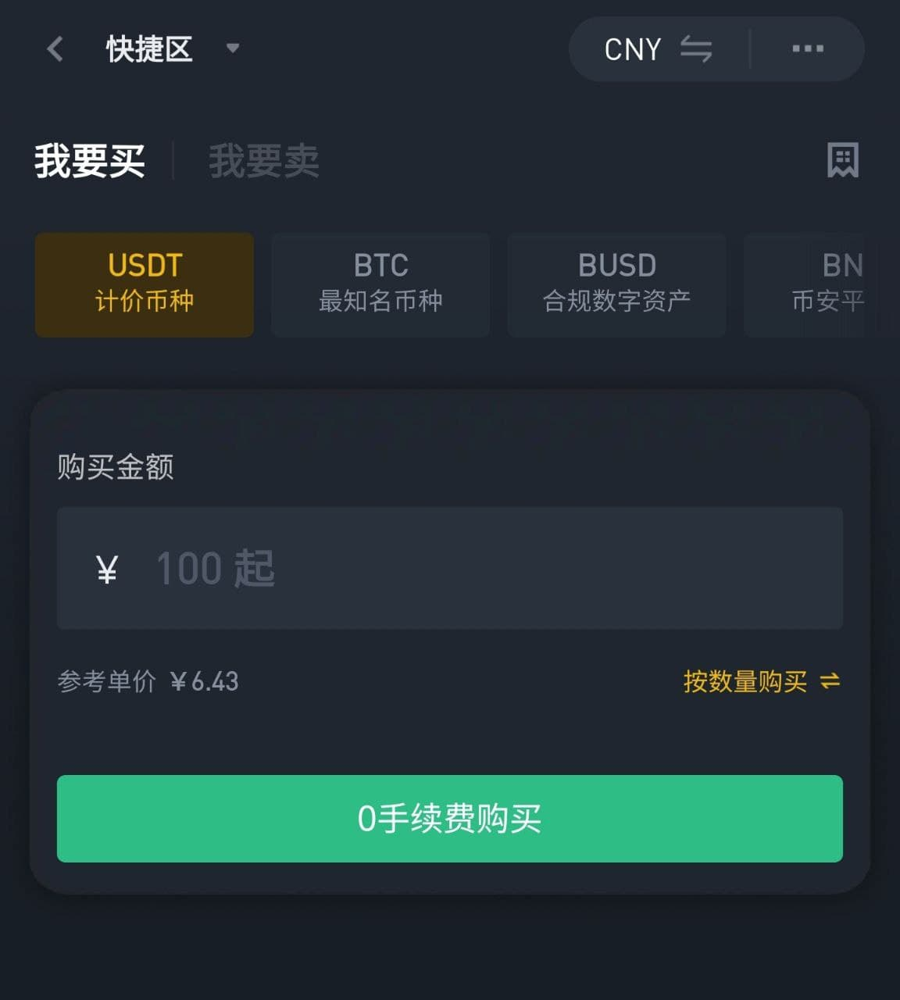
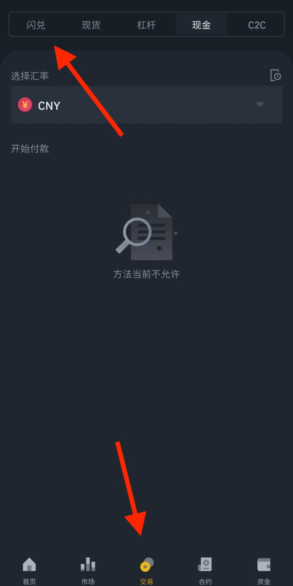
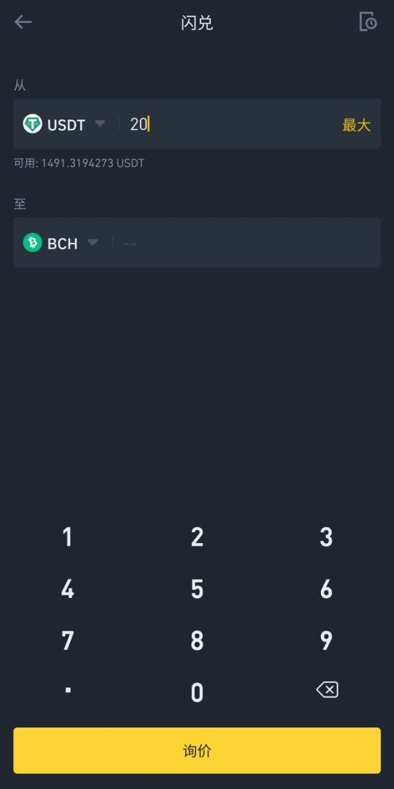
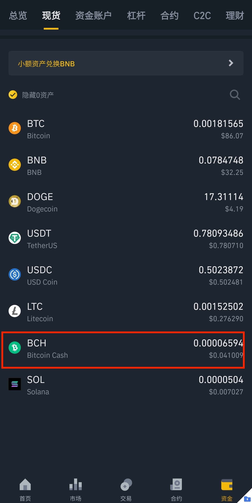
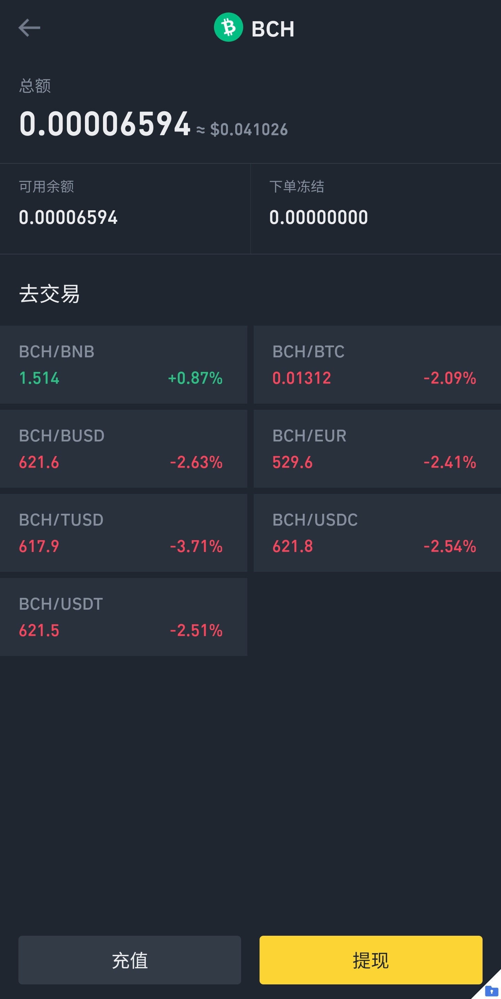
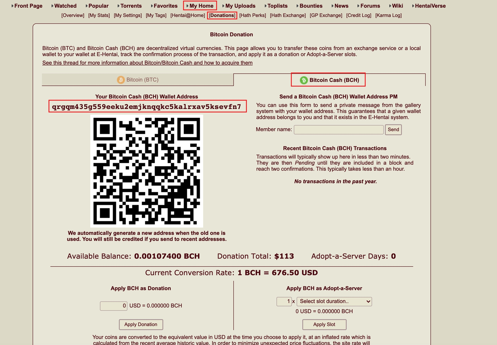

# eh使用15美元达到捐赠20美元的效果

e站表站: https://e-hentai.org/  
e站里站: https://exhentai.org/  
点击里站地址, 如果有内容出现, 则说明账号有里站权限
# 1.捐赠与不捐赠区别

eh有一部分内容(里区), 仅针对部分用户开放

捐赠: 可以立刻解锁里站权限(表站看里站内容), 立刻浏览全部eh内容

不捐赠: 新注册之后, 没有里区权限,如果想获得里区权限,需要使用欧美ip注册, 等待大约2周,    

有一定机率可以进入里区, 比较拼人品, 详情可以见另一篇文章.

有疑问的话, 欢迎加入群组讨论
https://t.me/carbon_research

# 2.如何使用15美元达到捐赠20美元的效果

首先不建议在localbitcoin直接使用支付宝,微信直接购买BTC进行捐赠, 使用支付宝,微信小额购买BTC, BTC基本会溢价5%-10%, 再加上btc高昂的体现手续费, 使用人民币直接购买btc, 20美元捐赠, 需要花费26-30美元

所以建议先用支付宝,微信先在币安购买usdt, 小额购买usdt, 溢价大约只有1/300, 可以说几乎无损了, 再使用usdt购买bch, 再进行捐赠

e站目前只接受2钟虚拟货币的捐赠, 不接受支付宝, 微信, 银行卡等方式

1. 比特币(BTC)
2. 比特现金(BCH)

**推荐使用比特现金(BCH)** 支付, 因为比特现金的矿工费远低于比特币

tips: 矿工费: 因为所有的虚拟货币要记录在链上, 所以每笔链上交易都要付给矿工矿工费

举例:

以币安交易所为例

**比特现金(BCH)**

提现手续费为0.001BCH, 以700美元/BCH计价, 手续费为0.7美金

比特币(BTC)

提现手续费为0.0005BTC, 以40000美元/BTC计价, 手续费为20美金

# 3. 如何使用15美元达到捐赠20美元的效果

## 捐赠有10%的奖励

- 首先, e站对于所有对捐赠, 都有10%的额外奖励(bonus), 举例来说

       如果现价BCH的价格为1000美元/BCH, 那么e站将会按照1100美元/BCH计算

 如果要捐赠20美元

 1.1x = 20    x = 18.2

 也就是说, 只需要捐赠18.2美元, 就想当与捐赠20美元

 那么如何只使用15美元呢, 请继续往下看

## 利用虚拟币的暴涨暴跌

- e站对与虚拟货币的计价方式, 并不是实时的价格, 而是以过去一段时间的平均值进行计算的, 而虚拟货币交易所, 是以实时的价格来计算的, 虚拟货币有一个特点, 就是经常暴涨暴跌, 我们就是要利用虚拟货币的暴涨暴跌, 来降低我们的成本

    举例说明

    假如目前BCH的价格为1000美元, 则e站会按1100美元/BCH来计算, 如果某天BCH出现20%的跌幅(几乎每个月都会有), 在交易所的买入价则为800美元, 但是由于这20%的跌幅是在很短的时间内完成的, e站是以过去一段时间的平均值来计算, 所以在e站的价格依然是1100美元

    x * 11 / 8 = 20

    x = 14.55美元

    在暴跌20%的情况下, 成本约为15美元, 其实在很多时候, 甚至可能有30%的跌幅, 成本会更低

# 4.如何购买加密货币

币圈3大交易所, 最大的交易所为币安, 其次为火币和Okex, **个人推荐[币安](https://www.binance.com/zh-CN/register?ref=36615347)**(需要翻墙), 区别如下

1. [币安](https://www.binance.com/zh-CN/register?ref=36615347) (千分之一的手续费, 操作界面友好)
2. [Okex](https://www.ouyi.cc/join/2260323)(千分之一的手续费, 操作界面不太友好, 不适合新人)
3. [火币](https://www.huobi.af/zh-cn/topic/double-reward/?invite_code=4zwd2223&t=1624157984421)(千分之二的手续费, 操作界面一般)

火币和Okex普通商户出金汇率可能比币安稍微高一些, 新韭菜很容易贪那几毛钱的利润, 然后收到收到**黑钱, 导致冻卡**(具体可百度), 对于新人来说, 币安做的完善得多, 不用担心太多的事情, 直接用就可以, 不用太担心黑钱的问题

首先, 在币安注册账户, 可以使用我的邀请链接

[https://www.binance.com/zh-CN/register?ref=36615347](https://www.binance.com/zh-CN/register?ref=36615347)

所有的数字货币交易, 都是以美元稳定币USDT进行交易的

注册账户, 完成身份认证后, 就可以购买USDT了

## 网页版

左上角,选择一键买币

然后就可以使用银行卡, 支付宝和微信购买USDT啦
输入要购买的金额, 得到美元稳定币USDT

闪兑中选择bch即可, 输入需要交换的usdt

## 手机版

在google play搜索binance既可以下载

注册时可以使用我的邀请码 36615347

注册账户后

交易选项卡中, 选择c2c

就可以购买usdt了,
选择交易, 然后选择闪兑选项卡

选择从usdt到bch, 输入数量, 询价,兑换

在资金, 现货选项卡中, 点击bch

选择提现

现在要填写提现地址, 要去e站自己的账户中获取

主网络选择BCH

然后进入e站, My Home → Donation → Bitcoin Cash 

左边可以看到一串字母, 已经用红框圈选, 复制, 粘贴到币安的提现地址, 进行提现, 大约半小时到账

底下输入20USD, 再点击Apply Donation就可以啦, 自动获得里区权限
