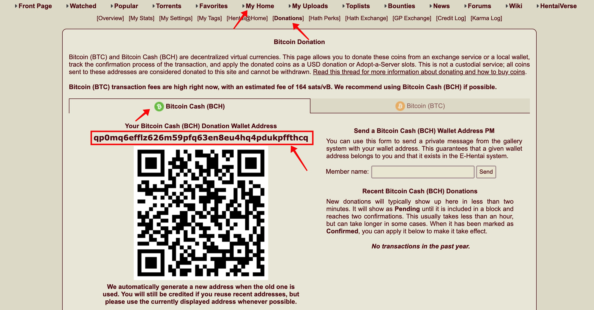
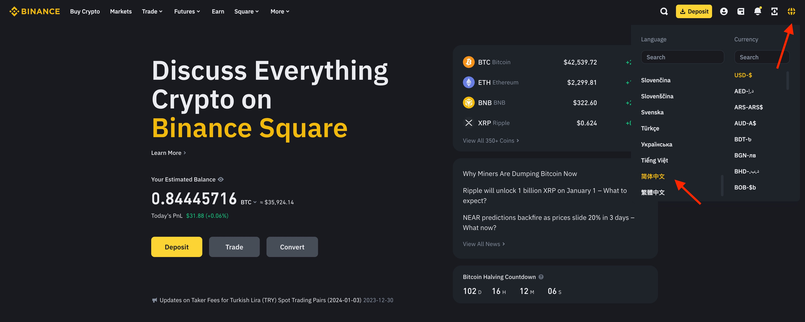
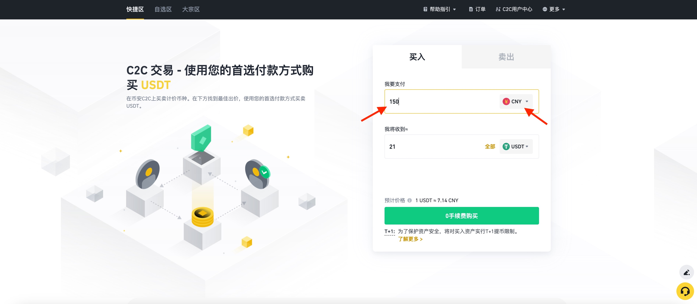
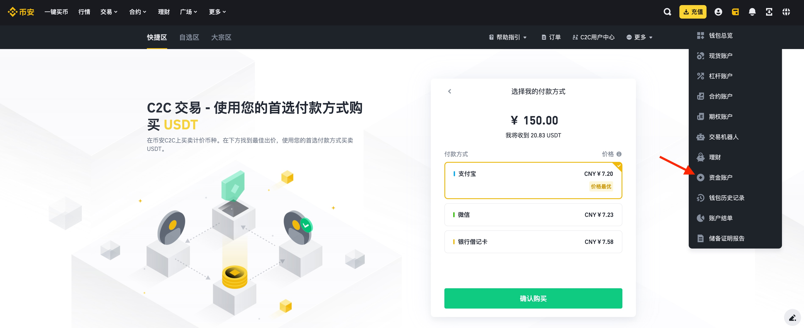
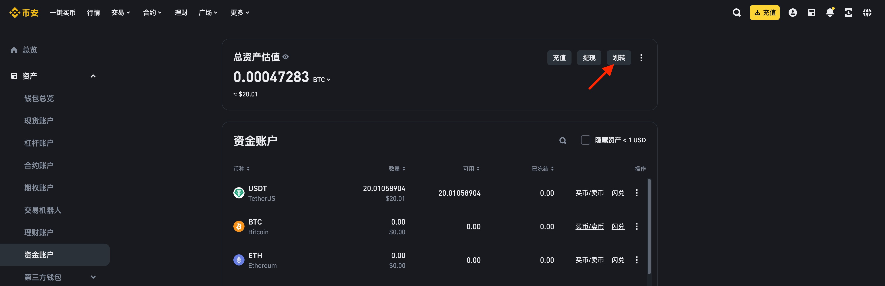
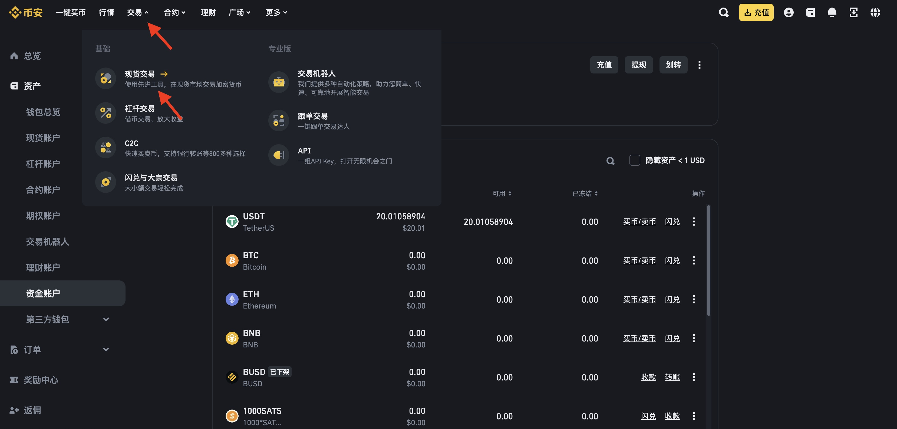
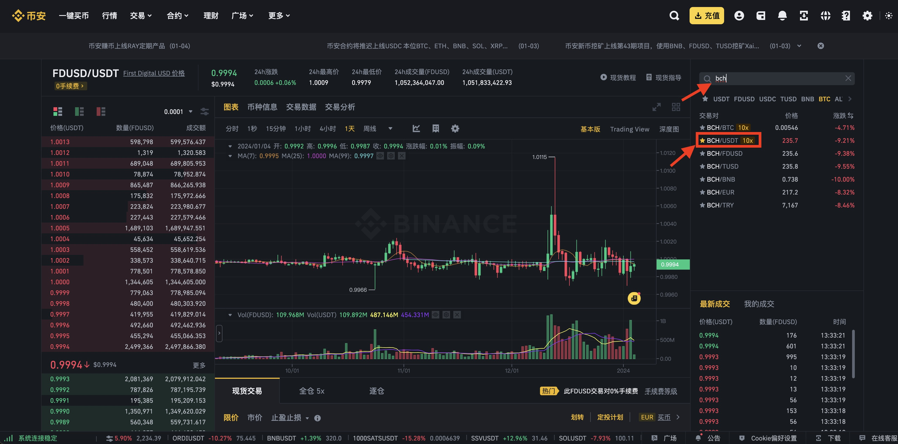
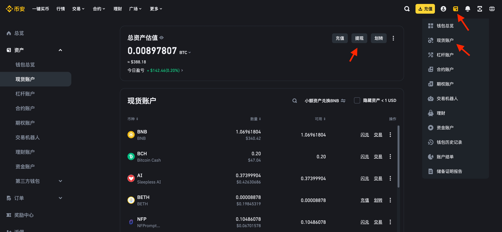
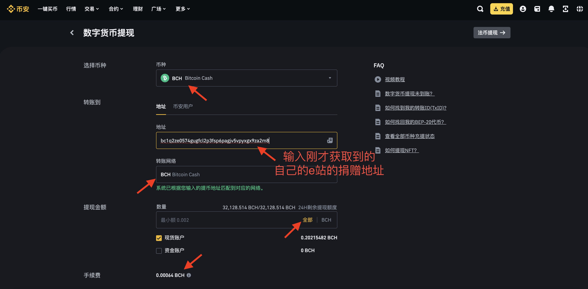
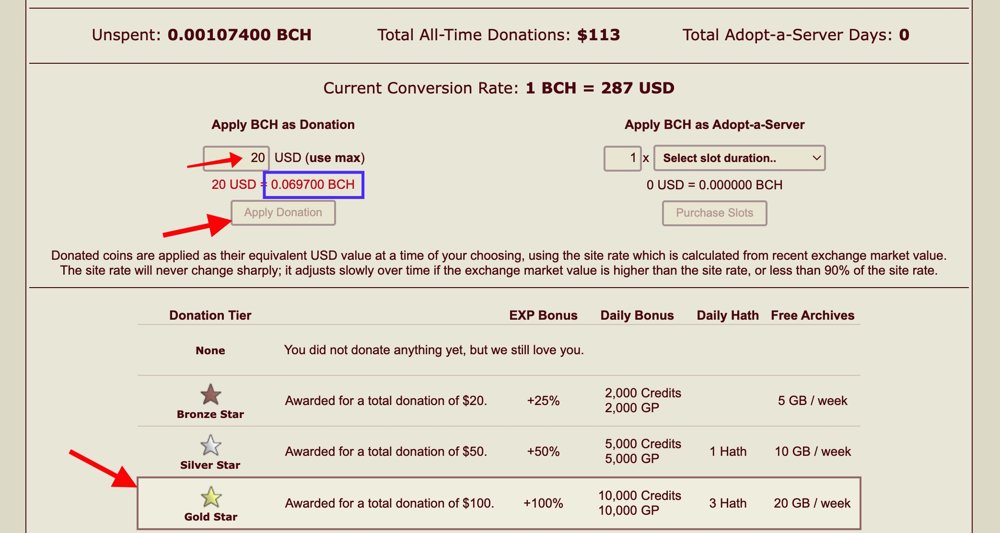

# eh捐赠教程

e站表站: https://e-hentai.org/  
e站里站: https://exhentai.org/  
点击里站地址, 如果有内容出现, 则说明账号有里站权限

图文教程如果有疏漏之处,可以参考视频教程  
[视频教程](https://www.youtube.com/watch?v=Ti5jsO7lg_M)  
不明白的地方可以tg群里提问  
https://t.me/carbon_research

实在嫌麻烦的朋友, 可以让楼主代为捐赠, 铜星200RMB(自己立刻捐赠成本约为150RMB) 详情请见  
[代捐赠](代捐赠.md)

## 目录

*  [eh捐赠教程](https://github.com/kk9448/ehDonate/blob/main/README.md)

*  [e站捐赠用户特别福利](https://github.com/kk9448/ehDonate/blob/main/eh捐赠用户特别福利.md)

*  [Ehv最新版本下载](Ehv最新版本下载.md)  

*  [数字货币相关](https://crypto0xpanda.notion.site/aa75a581ca684d94955dedacb54bcd68)

*  [eh搜索规则](https://github.com/kk9448/ehDonate/blob/main/eh搜索规则.md)

*  [509解决方案](https://github.com/kk9448/ehDonate/blob/main/ban以及509解决方案.md)

*  [ex无法跳页的解决方案](https://github.com/kk9448/ehDonate/blob/main/ex无法跳页的解决方案.md)

*  [代捐赠](https://github.com/kk9448/ehDonate/blob/main/代捐赠.md)

## 1.捐赠与不捐赠区别

eh有一部分内容(里区), 仅针对部分用户开放

**捐赠**: 可以立刻解锁里站权限(表站看里站内容), 立刻浏览全部eh内容，表站的速度个人感觉也比里站快\
**不捐赠**: 新注册之后, 没有里区权限,如果想获得里区权限,需要使用原生欧美ip注册, 等待大约2周,有一定机率可以进入里区, 比较拼人品

详情请见\
[e站捐赠用户特别福利](eh捐赠用户特别福利.md)

有疑问的话, 欢迎加入群组讨论\
https://t.me/carbon_research

## 2.获取自己e站账户的捐赠地址

进入e站, My Home → Donation → Bitcoin Cash\
左边可以看到一串字母

**qp0mq6efflz626m59pfq63en8eu4hq4pdukpffthcq**

这就是我们的bch钱包地址, 复制下来, 我们之后要用

<div data-full-width="false"><figure><figcaption><p>获取自己的bch地址</p></figcaption></figure></div>

## 3.如何购买数字货币

**个人推荐**

**币安**:  全球最大交易所，交易量最大大,流动性最强,用户数最多, 安全性最高. 

安卓币安官方App下载地址:\
https://download-1306379396.file.myqcloud.com/pack/BNApp_F0000526.apk

币安iOS App下载教程:\
https://www.marketwebb.link/zh-CN/download-guide

[币安注册链接](https://www.binance.com/zh-CN/join?ref=R1SE0A44)  (该链接需要翻墙，不要使用美国ip, 邀请码 **R1SE0A44**, 使用邀请码可免费领取3美元)  

[币安注册链接](https://www.marketwebb.black/zh-CN/join?ref=R1SE0A44)(该链接免翻墙，大陆直连, 邀请码 **R1SE0A44**, , 使用邀请码可免费领取3美元)  

使用上面我的邀请链接注册, 或者手动填写邀请码 **R1SE0A44**  
2025年08月1日起, 通过我的邀请码注册币安, 可以获得[3美元福利](https://www.binance.com/zh-CN/join?ref=R1SE0A44)以及永久手续费返现
完成身份验证后,私聊 @carbon_x可获得3美元. 
完成后, 请telegram **私聊 @carbon_x 领取3美元福利**,  (推荐使用台湾ip注册, 不要使用美国,日本的ip, 币安不对这几个地方提供服务)，使用大陆身份完成验证即可.  
不填写邀请码什么都没有,是净亏的.
大户可以telegram **私聊 @carbon_x**

### 网页版教程(手机版教程在后边)

切换语言为简体中文



左上角,选择一键买币

<figure><figcaption><p>选择一键买币</p></figcaption></figure>

所有的数字货币交易, 都是以美元稳定币USDT(与美元1:1, **1 USDT就相当于1美元**)进行交易的
注册账户, 完成身份认证后就可以使用银行卡, 支付宝和微信购买USDT了

输入要购买的金额150, 选择CNY, 点击购买, 之后跟着平台提示进行操作即可

<figure><figcaption></figcaption></figure>

购买完成后, usdt会出现在我们的资金账户中



进入资金账户后, 点击划转



选择从资金账户划转到现货账户, 选择USDT, 输入数量,点击确认


选择交易,现货交易



首页中选择最上方的搜索框, 输入bch, 选择bch/usdt交易对



选择市价, 输入20, 点击买入bch


回到现货账户, 点击提现



选择bch, 把开头获得的地址粘贴进去, 转账网络选择bch, 点击全部\
需要注意的是,我们要保证减去手续费后, 大于下图中篮框里的值





到账后, 底下输入20USD, 再点击Apply Donation捐赠就完成了, 底下会显示你的捐赠级别, 之后就可以在表站搜索到里站的内容

### 手机版

首先在应用商店中下载币安\
[安卓手机下载币安App教程](安卓手机下载币安App指南.md)\
[苹果手机下载币安App教程](苹果手机下载币安APP指南.md)

使用我的邀请码 **R1SE0A44** 或者 [邀请链接](https://accounts.binance.com/zh-CN/register?ref=R1SE0A44) 注册, 可以**免费获得3美元以及永久最高比例返现**

注册账户后,左上角进入账户管理, 下方切换为专业版


交易选项卡中, 选择c2c


就可以使用银行卡,微信,支付宝,购买usdt了\
选择快捷区, 输入150


首页中选择最上方的搜索框, 输入bch


选择bch/usdt交易对


点击买入


选择市单价, 输入20,点击买入bch


之后在底部选择资金, 在上方选择现货选项卡, 点击bch


选择提现


选择通过区块链转账


然后进入e站, My Home → Donation → Bitcoin Cash\
红色方块中的一串数字, 就是自己eh账户的bch地址,复制下来, 之后要填写到币安的提现地址之中.

提现地址填写我们上一步中获取的, 自己eh账户的bch地址, 复制粘贴到币安的提现地址\
主网络选择bch,输入需要提现的数量,点击提现


在捐赠页面下方的框里输入20, 蓝色方块里显示的就是你最少需要的bch数量\
在提现时, 扣去手续费后, 提现的数量必须大于等于蓝色方块里的数量


到账后, 底下输入20USD, 再点击Apply Donation捐赠就完成了, 底下会显示你的捐赠级别, 之后就可以在表站搜索到里站的内容

## 4.如何使用15美元达到捐赠20美元的效果

e站目前只接受2钟虚拟货币的捐赠, 不接受支付宝, 微信, 银行卡等方式

1. 比特币(BTC)
2. 比特现金(BCH)

**推荐使用比特现金(BCH)** 支付, 因为比特现金的矿工费远低于比特币\
tips: 矿工费: 因为所有的虚拟货币要记录在链上, 所以每笔链上交易都要付给矿工矿工费

举例:\
以币安交易所为例

**比特现金(BCH)**\
提现手续费为0.001BCH, 以700美元/BCH计价, 手续费为0.7美金，比特币(BTC) 提现手续费为0.0005BTC, 以40000美元/BTC计价, 提现手续费为20美金

### 捐赠有10%的奖励

*   首先, e站对于所有对捐赠, 都有10%的额外奖励(bonus), 举例来说

    ```
     如果现价BCH的价格为1000美元/BCH, 那么e站将会按照1100美元/BCH计算
    ```

如果要捐赠20美元

1.1x = 20\
x = 18.2

也就是说, 只需要捐赠18.2美元, 就想当与捐赠20美元\
那么如何只使用15美元呢, 请继续往下看

### 利用虚拟币的涨跌

*   e站对与虚拟货币的计价方式, 并不是实时的价格, 而是以过去一段时间的平均值进行计算的, 而虚拟货币交易所, 是以实时的价格来计算的, 虚拟货币有一个特点, 就是经常涨跌, 我们就是要利用虚拟货币的涨跌, 来降低我们的成本

    举例说明

    假如目前BCH的价格为1000美元, 则e站会按1100美元/BCH来计算, 如果某天BCH出现20%的跌幅(几乎每个月都会有), 在交易所的买入价则为800美元, 但是由于这20%的跌幅是在很短的时间内完成的, e站是以过去一段时间的平均值来计算, 所以在e站的价格依然是1100美元

    x \* 11 / 8 = 20\
    x = 14.55美元

    在快速下跌20%的情况下, 成本约为15美元
