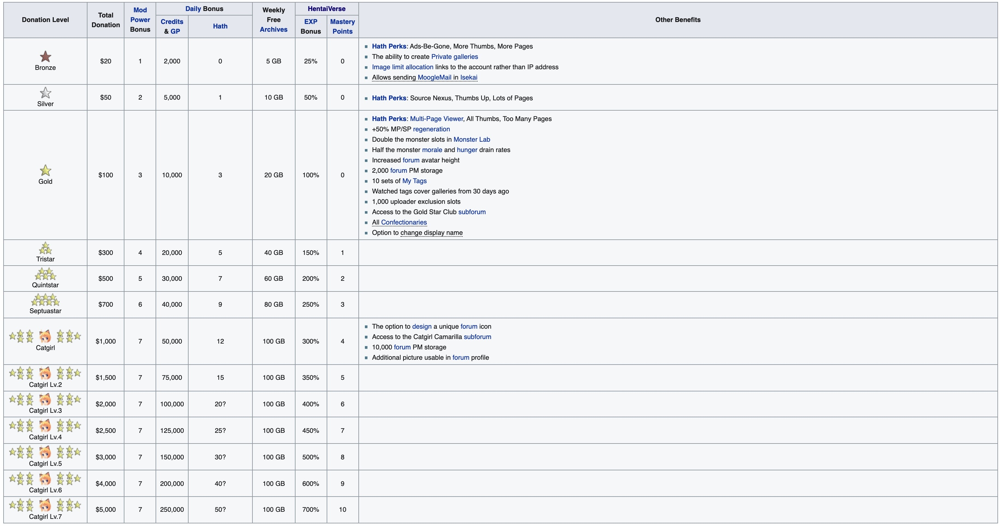

# e站捐赠用户特别福利

相对于非捐赠用户, 捐赠用户有一些额外福利
先上wiki图

主要有3种级别铜星,银星, 金星, 和猫娘
下面分别来说明

## 铜星(捐赠20美金):
1) 去除e站网页版所有广告
2) 预览图增加到每页10行(注: 画廊每行是5张图片, 非捐赠用户每页有4行(一页20张), 铜星用户10行(一页50张))
3) 每日图片配额x2 (注: 非捐赠用户5000, 铜星用户10000)
4)可以创建隐私画廊(仅你自己可见)
5)图片配额跟随账户不是ip(注: 多个非捐赠用户使用同一ip, 将消耗同一个配额, 铜星用户, 配额按照账号计算)
6)可以在Isekai发送MoogleMail

## 银星(捐赠50美金)
相比铜星, 增加
1)浏览原图: 可以直接浏览无损原图
2)预览图增加到每页20行(一页100张)
3) 每日图片配额x5(25000张每天)

## 金星(捐赠100美金)
相比银星,增加
1) Multi-Page Viewer(MPV, 在e张可以不点击下一页, 直接浏览整个画廊)
2) 预览图增加到每页40行(一页200张)
3) 每日图片配额x10(50000张每天)
4) 在HV中,MP/SP重新生成速度+50%
5) 在HV中,怪物插槽增加一倍
6) 在HV中, 士气和饥饿速度减半
7) 增加论坛图片高度
8) 论坛可以储存2000条私聊
9) 在my tags中可以储存10条预设(my tags是订阅中的预设文件, 非捐赠用户只有一个, 金星有10个)
10) 订阅选项卡, 可以显示过去30天的订阅(非金星用户7天)
11) 1000个上传专属插槽
12) 可以进入金星俱乐部
13) 获得所有的甜食(e站奖章, hath + 8每天(8 * 1), exp获得+160%  (8 * 20%))
14) 可以更改论坛的显示名

## 猫娘(捐赠1000美金)
相比金星, 增加
1) 可以自定义论坛标识
2) 可以进入猫娘俱乐部
3) 可以储存10000条私信
4) 论坛的个人信息可以增加额外的图片

捐赠教程请见
[如何使用15美元完成20美元捐赠](如何使用15美元完成20美元捐赠 (https://github.com/kk9448/ehDonate/blob/main/README.md))
