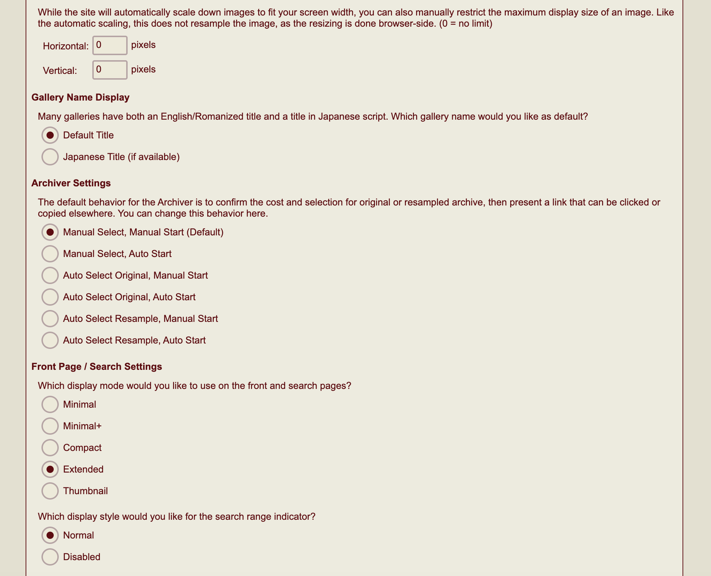
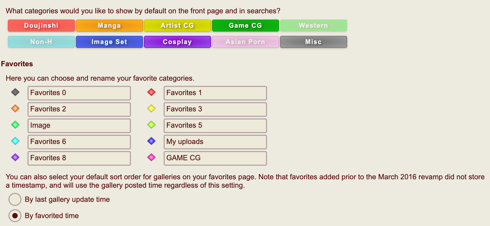
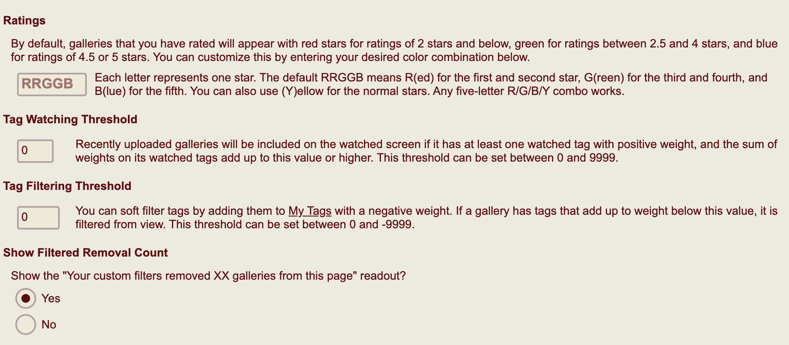
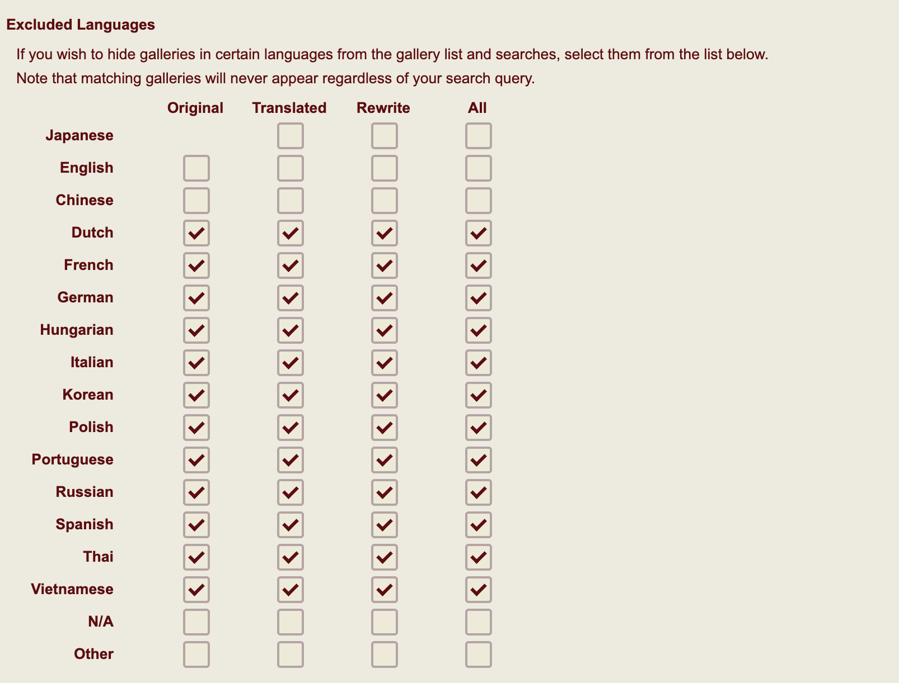
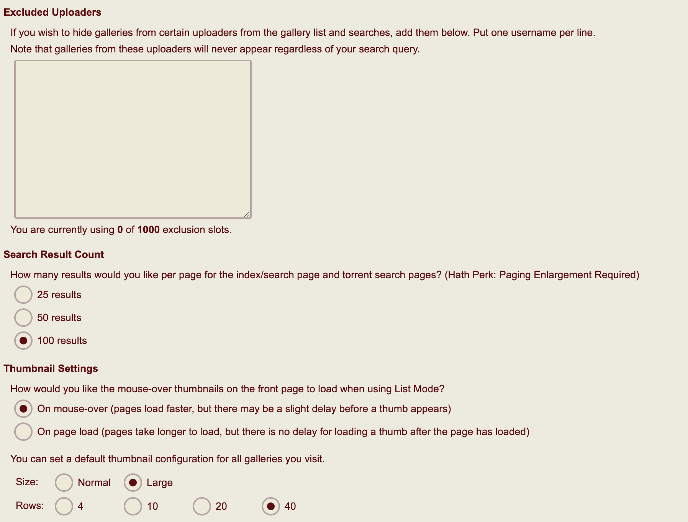
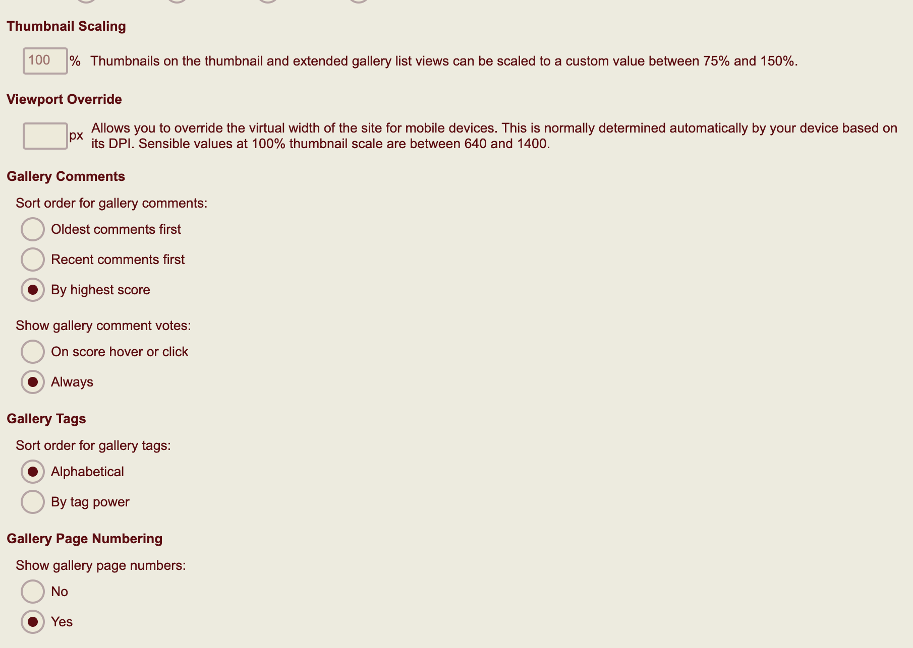

# 目录
*  [eh捐赠教程](https://github.com/kk9448/ehDonate/blob/main/README.md)

*  [e站捐赠用户特别福利](https://github.com/kk9448/ehDonate/blob/main/eh捐赠用户特别福利.md)

*  [数字货币相关](https://crypto0xpanda.notion.site/aa75a581ca684d94955dedacb54bcd68)

*  [eh搜索规则](https://github.com/kk9448/ehDonate/blob/main/eh搜索规则.md)

*  [509解决方案](https://github.com/kk9448/ehDonate/blob/main/ban以及509解决方案.md)

*  [ex无法跳页的解决方案](https://github.com/kk9448/ehDonate/blob/main/ex无法跳页的解决方案.md)

*  [代捐赠](https://github.com/kk9448/ehDonate/blob/main/代捐赠.md)

Image Load Settings
-------------------

第一个选择Any Client就可以, 该选项的含义是你愿不愿意使用e站的分布式加速服务H@H

第二个选项Image Size Settings
建议选择Auto, 对于手机等小设备来说, 原图和重新取样的图片, 肉眼很难分辨出区别, 
对于电脑等大的设备, 原图也会导致加载时间变长,影响体验, 建议使用重新取样图片浏览, 
下载时再下载原图

Gallery Name Display
--------------------

建议选择Default Title, 对日文不熟悉的话, 日文标题难以帮助记忆, 英文标题反而更好

Archiver Settings
-----------------

推荐选择Manual, Manual start, 当使用e站的Archiver download的时候, 
手动选择下载图片的质量, 手动开始下载, 个人是比较偏向手动

Front Page / Search Settings
----------------------------

推荐选择Extended
个人觉得更有效率

Which display style would you like for the search range indicator?
------------------------------------------------------------------

选择Normal打开就行,有总比没有好

过滤器
---

我个人是关掉了Western, Non-H, Asian Porn, 这个3个实在是不符合我的喜好

下面我选择的是by favorited time, 收藏夹本子排序, 我个人是喜欢按收藏时间排序
这样找本子的时候, 脑子里怎么也有一个大概的收藏时间顺序, 如果选择By last Gallery 
Update time, 就是按画廊的更新时间排序, 因为上传者可以在任何时间更新画廊, 
就会导致收藏夹完全是乱序排列的, 个人偏向by favorited time

这几个选择默认就行

语言过滤器
-----

这里要注意下
选择对号的,是被排除的语言选项, 注意,{span class="text-red-600"}下方的N/A不要勾选{/span}
N/A是not available的意思, 很多画廊是没有文字的, 比如ImageSet
和一些ArtistCG, 如果你勾选了,这些就会被排除

Excluded Uploaders
------------------

排除不喜欢的上传者, 一行放一个名字

Search Result Count
-------------------

每页的搜索结果数量, 越多越好
50和100需要捐赠或者使用Hath购买

Thumbnail Scaling
-----------------

预览图放大,或者缩小, 手机上一般不用更改, 电脑上可以选择改为150%, 
但是会更糊一些(因为图片的质量不变,单纯的放大)

Gallery Comments
----------------

我选择的是评分最高的放在前面

Gallery Tags
------------

alphabetical: 意思是按照字母顺序排序
by tag power: 按照tag的权重排序
推荐alphabetical

Gallery Page Numbering
----------------------
显示页数,个人偏向yes

Original Images
---------------
加载原图, 建议选择Nope(不), 加载原图,一会大量增加加载时间, 二会大量的消耗
流量配额(好像大约是8倍), 带来的体验提升并不大, 如果喜欢,下载的时候选择原图
下载就好, 没必要预览时开原图

Multi-Page Viewer
-----------------
个人建议选择Nope(不), 在ehv中该选项没有任何作用
网页端我个人更偏向手动打开

Multi-Page Viewer Display Style:
--------------------------------
我选择的是在中间, 这样左边可以显示预览图

Multi-Page Viewer Thumbnail Pane:
---------------------------------

显示预览图, 选择Show

  [1]: http://sinner.ehentai.info/usr/uploads/2023/01/2169861186.jpg
  [2]: http://sinner.ehentai.info/usr/uploads/2023/01/3602378395.png
  [3]: http://sinner.ehentai.info/usr/uploads/2023/01/4036165884.png
  [4]: http://sinner.ehentai.info/usr/uploads/2023/01/1035705903.png
  [5]: http://sinner.ehentai.info/usr/uploads/2023/01/3815684319.png
  [6]: http://sinner.ehentai.info/usr/uploads/2023/01/1780974548.png
  [7]: http://sinner.ehentai.info/usr/uploads/2023/01/2173894386.png
  [8]: http://sinner.ehentai.info/usr/uploads/2023/01/4061132242.png