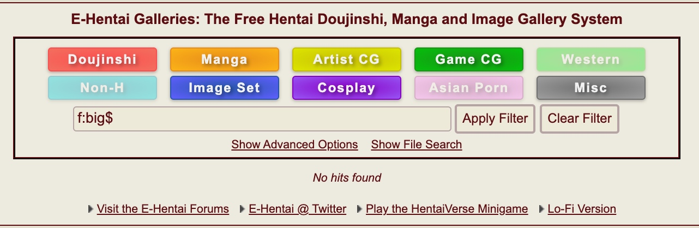

# 简介
在大类上, e站的搜索分为2种

1.对标题进行搜索

2.对标签进行搜索

是一个基于NameSpace(命名空间) + Tags(标签)的搜索系统

比如m:milf

m是NameSpace, milf是Tag

示例一

f:milf(等同于female:milf)

表示**只搜索标签**, NameSpace为f, tag为milf

如下图所示, 搜索结果有42,203个

示例2

milf

表示**同时搜索标签和标题**, 如下图所示, 搜索结果有42,543个

因为同时搜索了标题, 所以多出了下图中, 标题中有milf, 而标签中没有milf的画廊

示例3

搜索词应以空格分隔（逗号不能用作分隔符), **表示交集**

f:milf m:muscle

同时拥有f:milf和m:muscle的画廊为1658个

示例4

-号表示去除

pokemon -furry

表示同时在标题和标签下搜索pokemon, 之后再去除标题和标签中所有带furry的画廊

示例5

**双引号""用来表示有多个单词的tag**

f:"big breasts" f:"sex toys" f:"double penetration"

如果这里写成这样 f:big breasts, 系统会把它当成2个搜索条件

f:big和breasts,

会匹配标签中的f:big和标题或者tag中带有breasts的交集(对breasts进行搜索时,会匹配f:huge breasts)

而f:"big breasts"会精确匹配, 把big breasts当成是一个tag,而不是分开的两个

示例6

**$表示强制结尾**

c:sakura$(c表示character)

使用$号结尾, 搜索结果中将不包含c:sakura kinomoto和c:sakura haruno等标签,搜索结果的标签必须为c:sakura, 不能多任何一个字符

再举一个例子
f:big$表示要搜索名字为big的标签, 但很明显,eh没有big这个标签, 所以搜索结果为空

示例7

通配符

*可以表示0个1个或者多个任意字符

举例

`comic*xo*4`可以匹配 `comicYYYYYYYxoKKKKKKK4`(任意个字符)或者`comicxo4`(0个字符)

待更新....