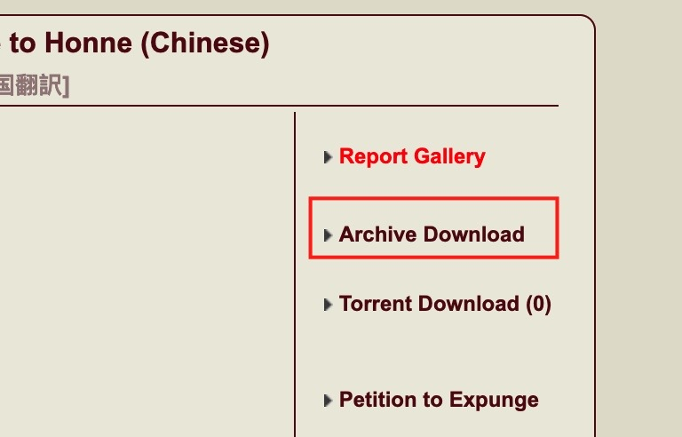
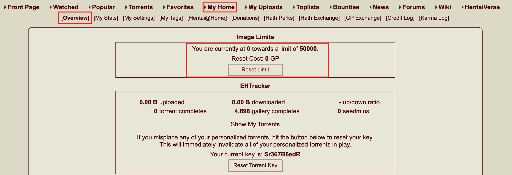

# 目录

*  [eh捐赠教程](https://github.com/kk9448/ehDonate/blob/main/README.md)

*  [e站捐赠用户特别福利](https://github.com/kk9448/ehDonate/blob/main/eh捐赠用户特别福利.md)

*  [数字货币相关](https://crypto0xpanda.notion.site/513609bac67c4979ab2a5f7c9a49c57b?pvs=4)

*  [eh搜索规则](https://github.com/kk9448/ehDonate/blob/main/eh搜索规则.md)

*  [509解决方案](https://github.com/kk9448/ehDonate/blob/main/ban以及509解决方案.md)

*  [ex无法跳页的解决方案](https://github.com/kk9448/ehDonate/blob/main/ex无法跳页的解决方案.md)

*  [代捐赠](https://github.com/kk9448/ehDonate/blob/main/代捐赠.md)

&emsp; &emsp; e站上有3种货币, GP, Credit, Hath 按价值从小到大排序

### `GP < Credit < Hath`
 
 1 hath ≈ 2970 credit
 292 credit ≈ 1kGP
 
##  GP:用来支付画廊下载, 恢复浏览配额
 
 
 注: ehv中的下载, 是使用爬虫爬网页端端内容, 并不是e站的正规下载方式, 论坛甚至一部分用户认为ehv这种使用爬虫下载, 大量占用了e站的资源, 菠萝(e站站长)目前对爬虫下载是睁一只眼闭一只眼的态度, 只对爬虫过量下载进行了限制
 
 下面列出正规下载方式

如图,给出了2种下载方式
    Download Original Archive: 下载原图 25.10MB
    Download Original Archive: 下载重新取样 1.76MB
这里之所以我是Free, 是因为捐赠用户每个月都有一定的免费配额, 否则需要花费GP

恢复浏览配额

Credit: e站小游戏HV中的积分,一般用在HV中

Hath: 解锁e站特别功能

有些功能只能通过Hath购买, 捐赠只能获取其中一部分
主要有影响的功能如下

1. 去广告                         20hath(或者捐赠20刀)
2. 直接浏览原图                    200hath(或者捐赠50刀)
3. MPV 一页中浏览整个画廊           300hath(或者捐赠100刀)
4. 增加预览图行数到10               50hath(或者捐赠20刀)
5. 增加预览图行数到20               100hath(或者捐赠50刀)
6. 增加预览图行数到40               250hath(或者捐赠100刀)
7. 增加浏览限额为原来的2倍           20hath(或者捐赠20刀)
8. 增加浏览限额为原来的5倍           50hath(或者捐赠50刀)
9. 增加浏览限额为原来的10倍          100hath(或者捐赠100刀)
10. 增加每页搜索结果数量到50         100hath(无法通过捐赠获得)
11. 增加每页搜索结果数量到100        500hath(无法通过捐赠获得)

全部功能请见
https://e-hentai.org/hathperks.php
