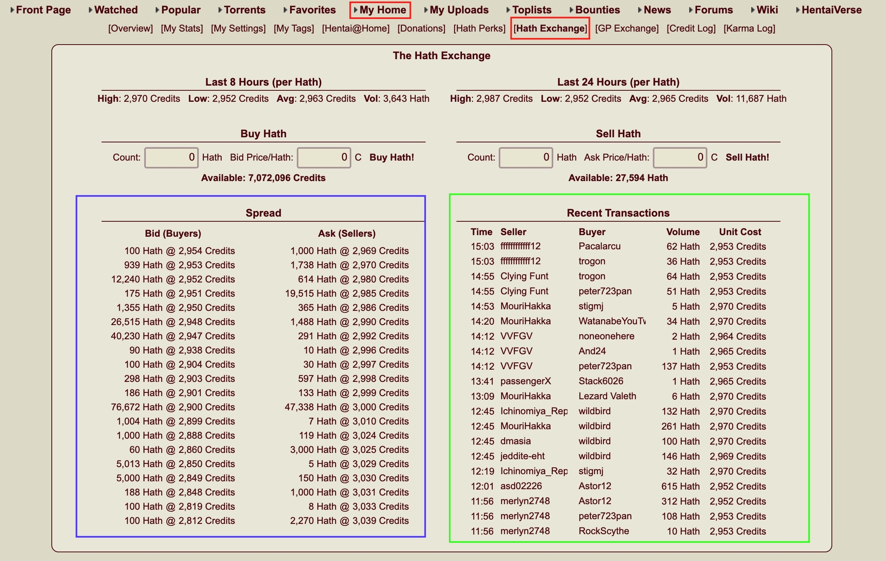
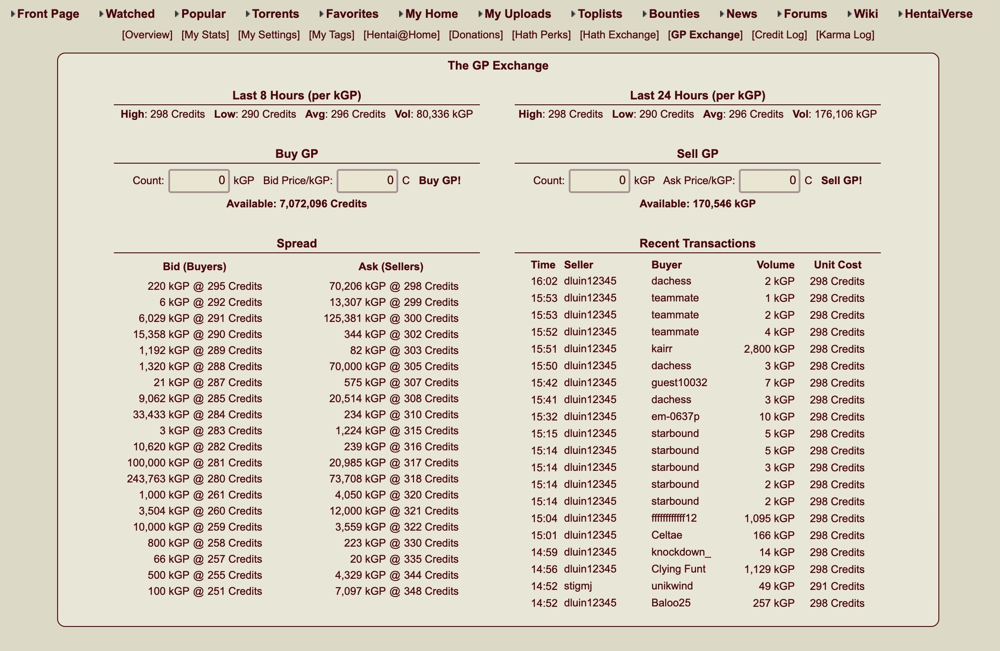

# hath, credit, GP可以自由进行转换

# 目录

*  [eh捐赠教程](https://github.com/kk9448/ehDonate/blob/main/README.md)

*  [e站捐赠用户特别福利](https://github.com/kk9448/ehDonate/blob/main/eh捐赠用户特别福利.md)

*  [数字货币相关](https://crypto0xpanda.notion.site/513609bac67c4979ab2a5f7c9a49c57b?pvs=4)

*  [eh搜索规则](https://github.com/kk9448/ehDonate/blob/main/eh搜索规则.md)

*  [509解决方案](https://github.com/kk9448/ehDonate/blob/main/ban以及509解决方案.md)

*  [ex无法跳页的解决方案](https://github.com/kk9448/ehDonate/blob/main/ex无法跳页的解决方案.md)

*  [代捐赠](https://github.com/kk9448/ehDonate/blob/main/代捐赠.md)

My Home -> Hath Exchange

 

如上图所示, 这是e站内部的一个交易hath的地方
主要分为2个大区域
蓝色的订单薄, 以及绿色的成交记录
首先我们看蓝色的区域

Bid(Buyers)买方
Ask(Sellers)卖方
@ 表示的每个的意思
先来看Bid下面
100 Hath @ 2954 Credits
100表示的是深度, 也就是在这个价格的数量
买方(想买Hath的人), 想用2954 credits来换一个Hath
买方在2954这个价格,想买100个hath

再来看Ask下面
1000 Hath @ 2969 Credits
出售者, 想用1个Hath, 交换2969个Credits, 这个价格有1000个Hath出售

买方出价2954, 卖方出价2969,所以没有成交

如果想立即成交, 出价2969即可
GP和Hath是同一个道理,如下图

 
