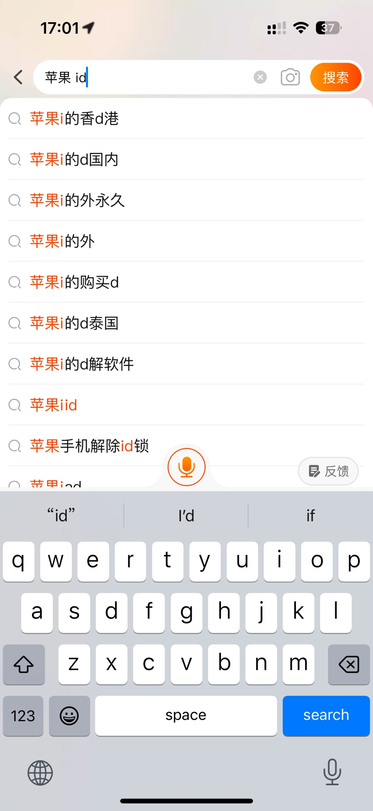
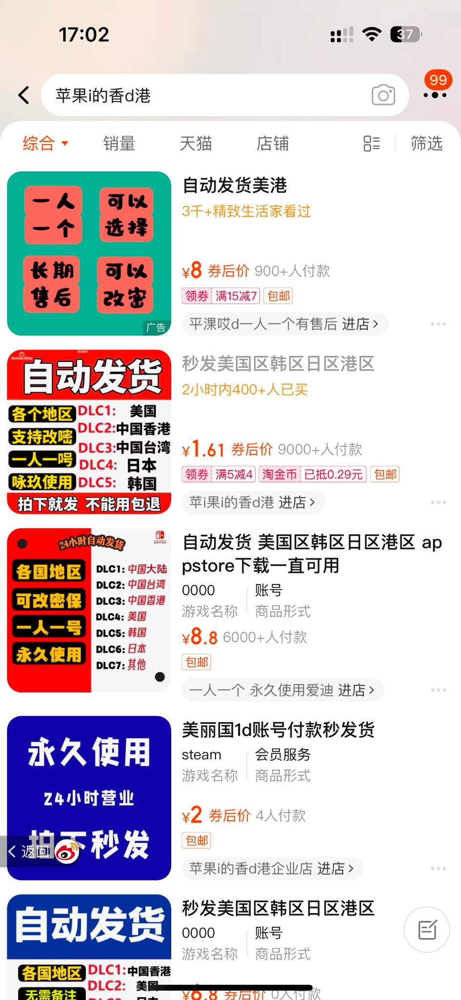
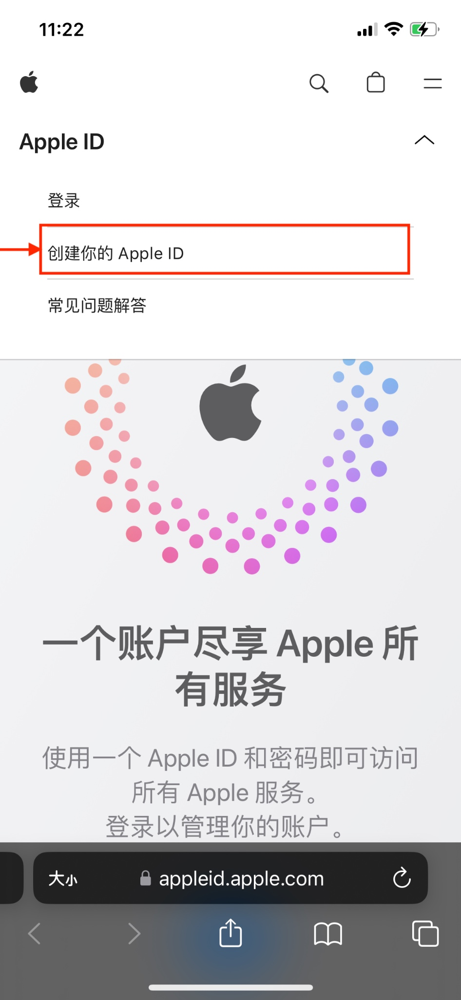
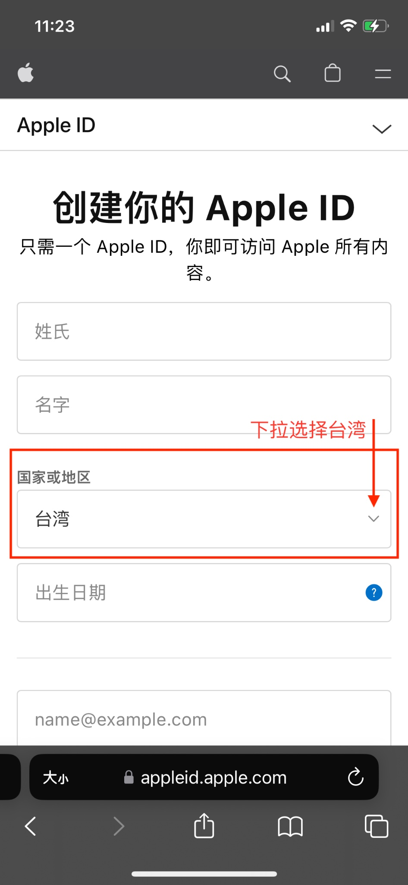
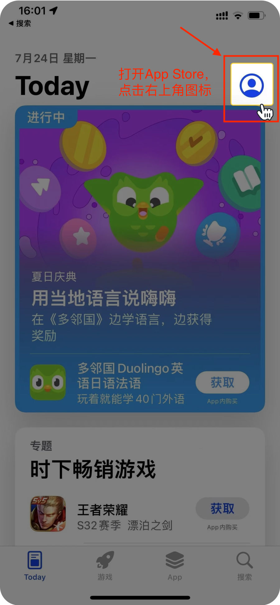
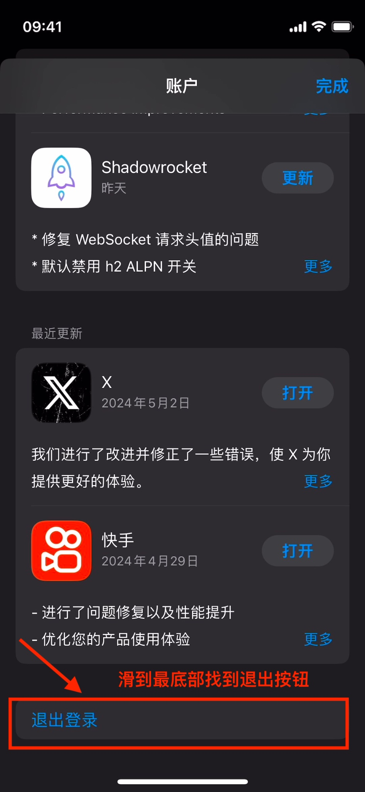
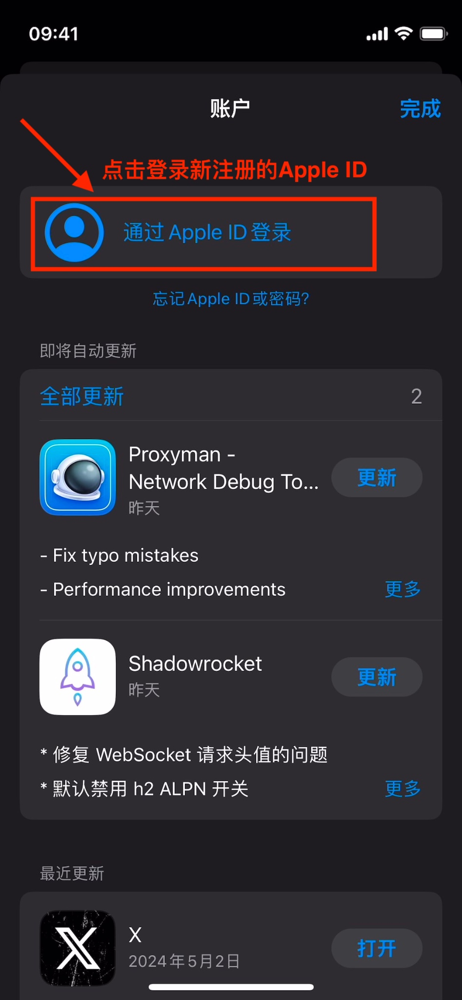
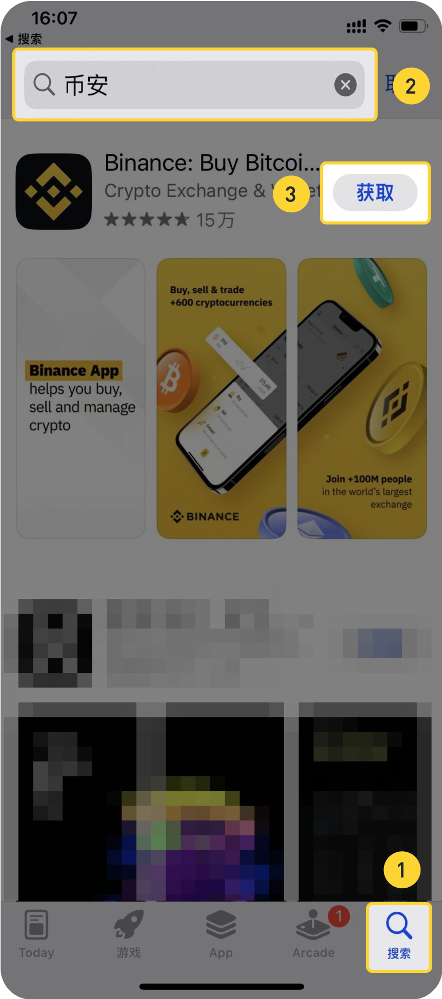
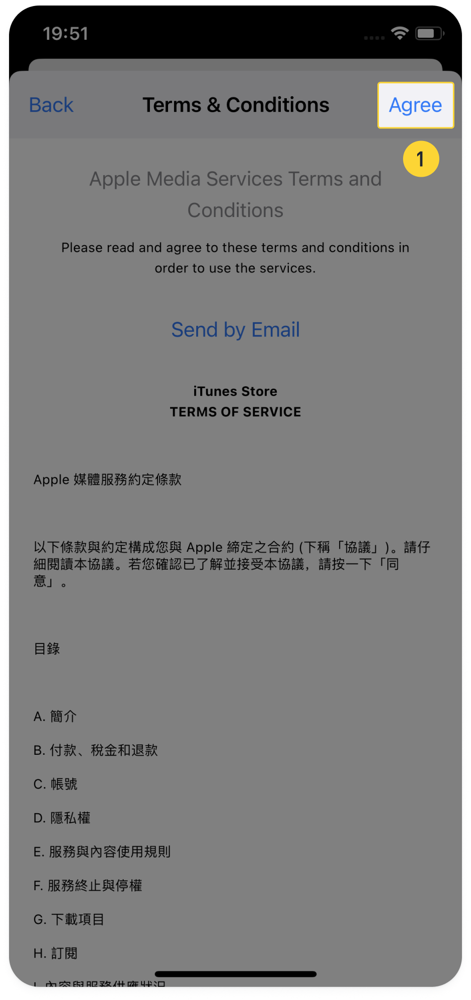
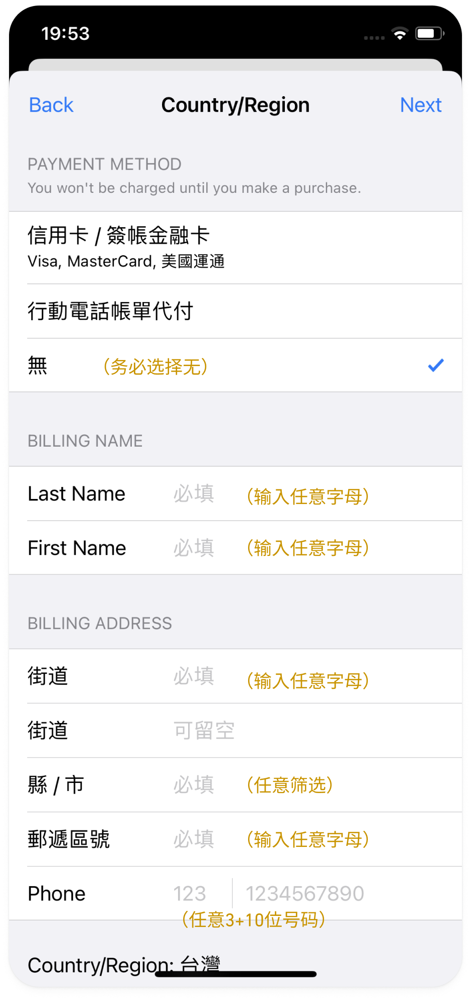

# 苹果手机下载币安App

# 目录

*  [eh捐赠教程](https://github.com/kk9448/ehDonate/blob/main/README.md)

*  [e站捐赠用户特别福利](https://github.com/kk9448/ehDonate/blob/main/eh捐赠用户特别福利.md)

*  [数字货币相关](https://crypto0xpanda.notion.site/aa75a581ca684d94955dedacb54bcd68)

*  [eh搜索规则](https://github.com/kk9448/ehDonate/blob/main/eh搜索规则.md)

*  [509解决方案](https://github.com/kk9448/ehDonate/blob/main/ban以及509解决方案.md)

*  [ex无法跳页的解决方案](https://github.com/kk9448/ehDonate/blob/main/ex无法跳页的解决方案.md)

*  [代捐赠](https://github.com/kk9448/ehDonate/blob/main/代捐赠.md)

由于中国大陆的苹果应用商店没有上架币安APP，所以需要使用海 外Apple ID，获取方式： 1. 自己注册一个新的海外Apple ID，下面有教程 2. 不会注册的人，也在淘宝上搜索“苹果i”买一个海外账号 （美国Apple ID不可以，推荐台湾地区Apple ID） 有了海外账号之后就可以准备安装了，详见“登陆新Apple ID下载”  

  

自己注册海外Apple ID步骤

1. 通过苹果官网注册：https://appleid.apple.com/account ，手机打 开后，创建Apple ID的按钮比较隐藏，点击右上角小箭头可以看 到 “创建你的Apple ID”  
2. 国家或地区：选择台湾。亲测台湾最稳定，语言也看得懂  
3. 邮箱和手机号
      a. 邮箱：已经注册过Apple ID的邮箱不能重复用，
         拿一个没用过的邮箱来填  
      b. 手机号：填写可收到验证码的手机号，可以直接填中国
         大陆 的手机号，以前注册过Apple ID的号码也可以重复使用  
4. 其他按步骤验证邮箱和手机号就好了

登陆新Apple ID下载

1.打开App Store，点右上角小人头进去，滑到最下面点“退出登录”  
2.同样小人头点进去，退出后登录海外Apple ID  
3.现在就可以搜索到币安了，点击获取

1. 点击 "获取" 币安APP后，可能需要同意协议和填写支付方式，支 付方式直接选择无。其他信息随便填，填乱七八糟数字都可以

第三步：注册币安 下载后打开币安APP，选择作为币圈老手，进入APP首页，点击“注册 /登录” – 直接输入中国手机号/邮箱 - 填写邀请码 **R1SE0A44**，可以**免费获得5美元以及永久最高比例返现**， – 输入验证码 –启用通行密钥(就 是扫脸验证), 完成验证后, 请telegram **私聊 @carbon_x 领取5美元**

