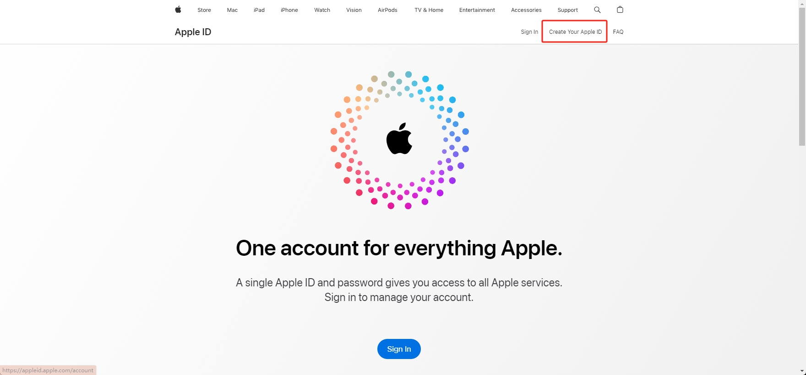
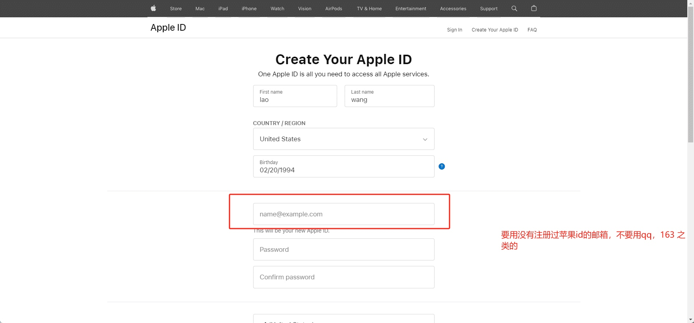
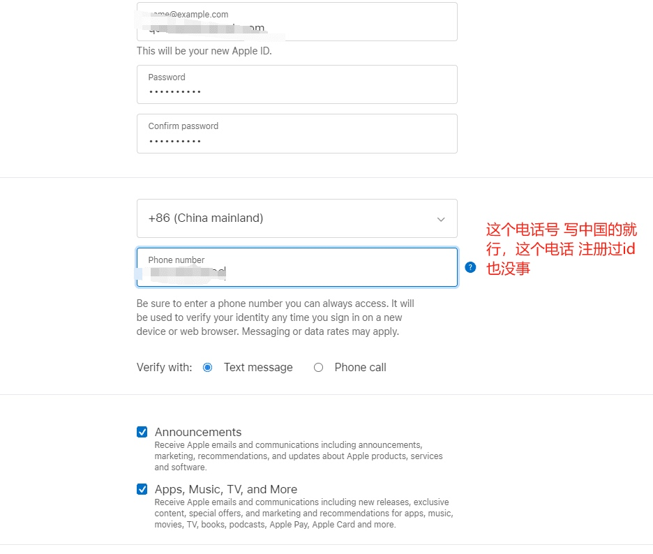
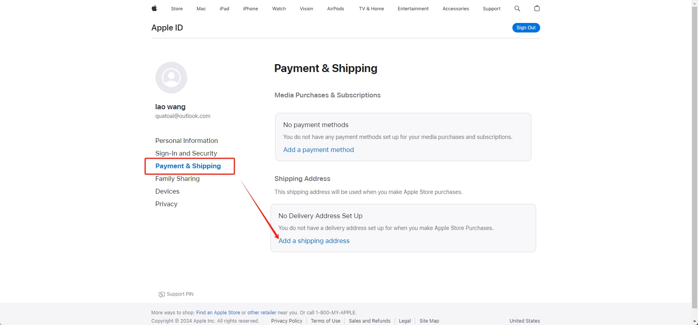
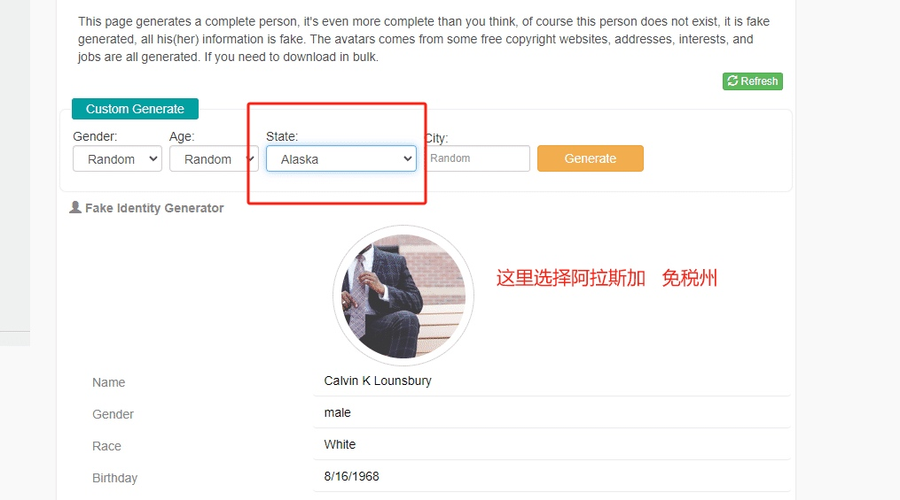

# 注册 美区 appstore 商店ID指南

美区 苹果id注册地址 https://appleid.apple.com/
点击创建 id 

这里 邮箱 要使用 没有注册过苹果id的邮箱   推荐新注册的   outlook 或者 gmail

电话号 使用中国的就行，这个电话 注册过苹果id也没事

接下来添加付款方式

这里先不填写   去这里生成一个美国地址https://www.fakepersongenerator.com/Random1/generate_identity

这里选择 阿拉斯加 免税州

然后一 一对应填写就行了

然后就可以去手机登录了
弹出这个检查

直接点检查

然后就可以正常使用了，app   store  就可以下载海外软件了